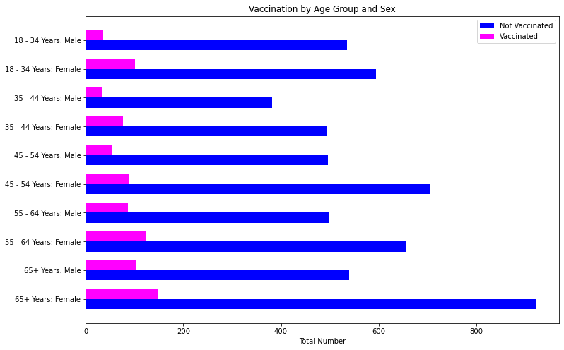

# H1N1-and-Seasonal-Flu-Vaccines


## Overview:
There have been several deadly pandemics throughout history, the topic of this project being the flu. According to the CDC, the flu is a contagious respiratory illness caused by influenza viruses. The H1N1 strain (also known as swine flu) was the cause of the 2009 pandemic, affecting millions worldwide. Significant efforts have since been made to develop and distribute vaccines to protect against this strain.

## Business Problem
My target audience is a public health official, such as the leadership team of the CDC. I was tasked with predicting whether someone has received their H1N1 vaccination. The results will be used to help provide guidance for future health concerns. 

Making sure you’re vaccinated and protected against contagious diseases such as the flu is important not just for your own health and safety, but for those around you. The goal with any contagious disease, such as the H1N1 flu, is to reach herd immunity status, which is when a large enough percent of the population has developed antibodies to protect against future infections. This will ultimately help limit the spread of the disease.

## Data
The data used in my analysis comes from the National 2009 H1N1 Flu Survey. Some key points:
- There were nearly 27,000 participants.
- Data was collected randomly through phone surveys.
- Participants were asked a range of questions, including if they were vaccinated, their age, gender, employment status, and other key questions. 

## Modeling
I started off by building a pipeline, simple imputing the binary and ordinal columns with the most frequent value, and both simple imputing with the most frequent and one hot encoding the categorical columns. My baseline model was a dummy classifier that had 67% accuracy, 21% precision, and 21% recall. 

My first simple model utilized SMOTE to address the class imbalance in my target via an ImPipeline. I used a logistic regression estimator that had 78% accuracy, 48% precision, and 72% recall. I then created a third model that used the best hyperparameters from the first simple model, and found a slight improvement in the results. As SMOTE prioritized recall (or minimizing false negatives), I decided to try a simple logistic regression without SMOTE to try and minimize false positives. 

My next few models tested out a simple logistic regression with various hyperparameters tuned. I found the results did not change significantly from model to model, with accuracy, precision, and recall only changing a fraction of a percent. I selected the simple logistic regression as my final model. 

## Evaluation
The scores for my final model are as follows: 
- Accuracy: 84%.
  - Out of all the predictions, my model was correct 84% of the time compared to the actual outcomes. 
- Precision: 71%
  - Out of all the positives predictions my model made, 71% of them were correct. 
- Recall: 42%
  - My models ability to identify positive cases was correct 42% of the time. 
- F1: 53%
  - This indicates that my model has a 53% balance of precision and recall. 

The confusion matrix for my final model had 5014 true negatives, 816 false negatives, 246 false positives, and 601 true positives. My model successfully minimized false positives. This is preferred: our goal is to reach herd immunity status, and if we have too many false positives (indicating someone is vaccinated when they are not), this would have a negative impact on our efforts. 


My final model had an AUC of 0.83, indicating it's pretty effective at predicting the correct class. 


## Recommendations: 
My first finding was that when doctors did not recommend vaccination to their patients, the count of vaccinations was extremely low. However, in cases where the doctor encouraged the vaccination, there were more people vaccinated than not!

I would recommend having more doctors encourage vaccination to all patients who are suitable for it. 


My second finding was that higher levels of knowledge about the H1N1 flu resulted in higher vaccination counts. When combined with education, college graduates who had the highest level of knowledge about the virus had the highest vaccination counts than any other grouping. The lower the level of education, and the less knowlege about the virus, resulted in lower counts of vaccination. 

I would recommend spread easy to understand information about both the virus and the vaccine, especially to those with lower education levels. 


My final founding was that males aged 18-44 had the lowest vaccination counts than any other age/sex combination. Females generally had higher vaccination counts, with females aged 65+ having the most. 

I would recommend first trying to understand why males aged 18-44 have such low vaccination counts, be it misconceptions about the virus or vaccine, lack of convenience, or some other factor. Then I would recommend finding ways to target this specific demographic to encourage vaccination. 



Implications for the stakeholder include increasing vaccination counts, which is a key part of achieving herd immunity. With any contagious (or otherwise) disease, herd immunity is a great goal as it means a large enough percent of the population has antibodies to the vaccine, which helps limit the spread of disease.

## Next Steps
1. Collaborating with healthcare providers: we can find ways to make information about both the virus and vaccine more readily available to the public.

2. Research marketing strategies: I'd like to find efficient and effective ways to target specific demographics and encourage vaccination. The more knowledge and awareness out there, the better.

3. Collect more data: this survey contained nearly 27,000 participants, but with more data, we could make more accurate predictions. I would also like to explore the idea of completing a new survey, since this was from 2009. I'm curious to see how the COVID-19 pandemic has changed this data.

## Conclusion
This project aimed to build a model that can predict whether someone has recieved the H1N1 flu vaccine. The goal in mind was to provide guidance to a public health official (such as the leadership team of the CDC) to help with any future health outbreaks or concerns. The dataset contained nearly 27,000 survey responses (the survey having been conducted as a random phone survey). I started with exploring the relationships between the variables, picked H1N1 as the target, and built several models. I chose to prioritize precision over recall, which aimed to minimize false positives, as I felt that had bigger health consequences. My final model was a simple logistic regression that had an accuracy of 84%, precision of 71%, recall of 42%, and F1 score of 53%.

## For More Information
Please find the general EDA in the  [General EDA](./code/General_EDA.ipynb) notebook, the full analysis in the [Final Jupyter Notebook](./Final_Notebook.ipynb), and the [presentation](./H1N1_Vaccination_Analysis_Presentation.pdf) here.

For additional info, please contact Rachel Goldstein at [rachelhgoldstein1@gmail.com](mailto:rachelhgoldstein1@gmail.com), or find me on [Linkedin](https://www.linkedin.com/in/rachel-goldstein-512540158/). 

## Repository Structure

```
├── code
│   ├── General_EDA.ipynb
│   └── Model_Analysis.ipynb.ipynb
├── data
│   ├── submission_format.csv
│   ├── test_set_features.csv
│   ├── training_set_features.csv
│   └── training_set_labels.csv
├── images
├── .gitignore
├── Final_Notebook.ipynb
├── H1N1_Vaccination_Analysis_Presentation.pdf
└── README.md
```

